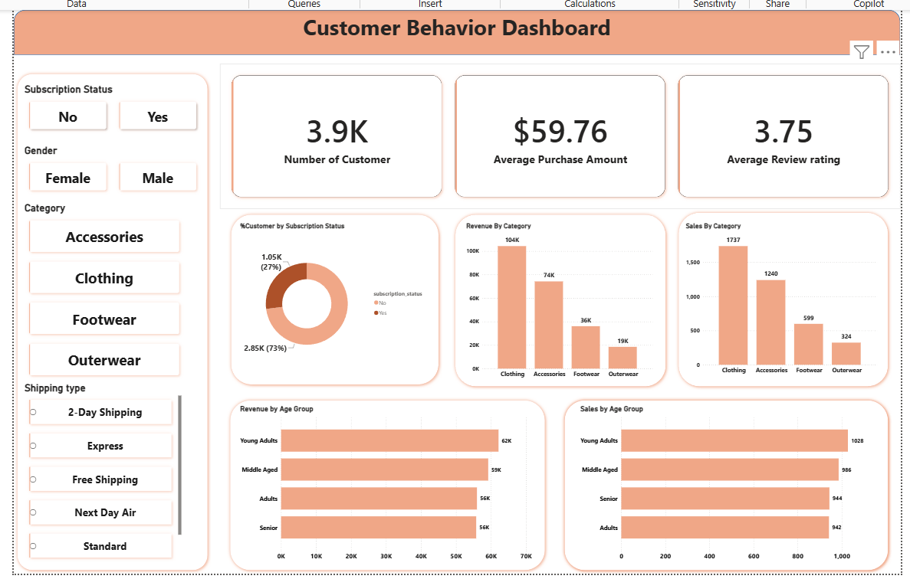

# 📊 Data Analytics Project — Python, Pandas & SQL

## 📌 Project Overview

This project is an end-to-end **Data Analytics project** designed to demonstrate how raw business data can be transformed into meaningful insights using **Python, Pandas, SQL, and data visualization**.

The project follows a practical analytics workflow:

**Raw Data → Data Cleaning → Exploratory Data Analysis → SQL Analysis → KPI & Insights → Visualization → Business Recommendations**

The objective is not only to analyze the dataset but also to answer important **business questions using data** and convert analytical findings into actionable recommendations.

---

## 🎯 Project Objectives

* Understand and explore the raw dataset
* Clean and preprocess the data
* Handle missing and inconsistent values
* Identify duplicates and data-quality issues
* Perform exploratory data analysis using Python
* Perform business analysis using SQL
* Calculate important KPIs and metrics
* Identify trends and patterns
* Generate actionable business insights
* Build visualizations to communicate findings
* Provide data-driven business recommendations

---

## 🛠️ Technologies Used

| Technology                  | Purpose                             |
| --------------------------- | ----------------------------------- |
| 🐍 Python                   | Data analysis and preprocessing     |
| 🐼 Pandas                   | Data cleaning and manipulation      |
| 🔢 NumPy                    | Numerical operations                |
| 🗄️ MySQL                   | SQL-based data analysis             |
| 📊 Power BI / Visualization | Dashboard and reporting             |
| 📓 Jupyter Notebook         | Analysis and documentation          |
| 🐙 Git & GitHub             | Version control and project sharing |

---

# 🔄 Project Workflow

```text
                RAW DATA
                   │
                   ▼
          Data Understanding
                   │
                   ▼
            Data Cleaning
          ┌────────┴────────┐
          │                 │
      Missing Values     Duplicates
          │                 │
          └────────┬────────┘
                   ▼
          Exploratory Analysis
              using Pandas
                   │
                   ▼
             Load into SQL
                   │
                   ▼
          Business Questions
                   │
                   ▼
             SQL Analysis
                   │
                   ▼
             KPI Generation
                   │
                   ▼
          Data Visualization
                   │
                   ▼
          Business Insights
                   │
                   ▼
        Recommendations
```

---

# 🐍 1. Data Analysis Using Python

Python was used for the initial data exploration, cleaning, transformation, and exploratory data analysis.

### Key Python Libraries

```python
import pandas as pd
import numpy as np
import matplotlib.pyplot as plt
```

### Data Loading

```python
df = pd.read_csv("dataset.csv")
```

### Initial Data Inspection

```python
df.head()
df.tail()
df.shape
df.info()
df.describe()
```

### Data Quality Checks

```python
df.isnull().sum()
df.duplicated().sum()
df.nunique()
```

### Data Cleaning

The following activities were performed:

* Removed duplicate records
* Handled missing values
* Corrected inconsistent data types
* Standardized categorical values
* Converted date columns
* Removed unnecessary columns
* Validated numerical fields
* Created derived columns where required

---

# 🐼 2. Exploratory Data Analysis

Pandas was used to identify patterns and trends within the dataset.

### Example Analysis

```python
df.groupby("Category")["Sales"].sum()
```

### Sorting

```python
df.sort_values("Sales", ascending=False)
```

### Aggregation

```python
df.groupby("Region").agg({
    "Sales": "sum",
    "Profit": "sum"
})
```

### Time-Based Analysis

```python
df.groupby("Year")["Sales"].sum()
```

The EDA phase helped identify:

* Top-performing categories
* Best-performing regions
* Sales and profit trends
* Customer behavior
* Product performance
* Revenue patterns
* Potential business problems

---

# 🗄️ 3. SQL Analysis

After cleaning the dataset using Python/Pandas, the cleaned data was imported into **MySQL** for structured business analysis.

SQL was used to answer business-oriented questions that are commonly asked in real-world analytics roles.

### Example SQL Queries

#### Total Sales

```sql
SELECT SUM(sales) AS total_sales
FROM sales_data;
```

#### Total Profit

```sql
SELECT SUM(profit) AS total_profit
FROM sales_data;
```

#### Category Performance

```sql
SELECT
    category,
    SUM(sales) AS total_sales,
    SUM(profit) AS total_profit
FROM sales_data
GROUP BY category
ORDER BY total_sales DESC;
```

#### Top Products

```sql
SELECT
    product_name,
    SUM(sales) AS total_sales
FROM sales_data
GROUP BY product_name
ORDER BY total_sales DESC
LIMIT 10;
```

#### Regional Performance

```sql
SELECT
    region,
    SUM(sales) AS total_sales,
    SUM(profit) AS total_profit
FROM sales_data
GROUP BY region
ORDER BY total_sales DESC;
```

---

# 📈 4. Key Performance Indicators

The project focuses on important business KPIs such as:

### Revenue

```text
Total Revenue = SUM(Sales)
```

### Profit

```text
Total Profit = SUM(Profit)
```

### Profit Margin

```text
Profit Margin = Profit / Revenue × 100
```

### Average Order Value

```text
AOV = Total Revenue / Number of Orders
```

Additional KPIs can be created depending on the dataset and business requirements.

---

# 📊 5. Data Visualization

Visualizations were created to communicate analytical findings clearly.

### Key Visualizations

* 📈 Sales trend over time
* 📊 Category-wise sales
* 💰 Profit analysis
* 🌎 Regional performance
* 🏆 Top-performing products
* 📉 Loss-making products/categories
* 👥 Customer analysis
* 📅 Monthly/Yearly trends

The final dashboard can be created using **Power BI** to provide an interactive business reporting experience.

---

# ❓ Business Questions

The project focuses on answering questions such as:

### Primary Questions

1. What is the total revenue generated?
2. What is the total profit?
3. Which category generates the highest revenue?
4. Which products perform the best?
5. Which region contributes the most sales?
6. What is the sales trend over time?
7. Which products/categories generate the highest profit?
8. Which products or categories are underperforming?
9. What are the major changes in business performance over time?
10. Which areas require management attention?

### Secondary Questions

* What is the average order value?
* Which months have the highest sales?
* Which region has the highest profit margin?
* Are high-sales products always highly profitable?
* Which categories have declining performance?
* Which products contribute significantly to overall revenue?
* What patterns can be identified from customer/order behavior?

---

# 💡 Business Insights

The analysis is used to identify meaningful business insights such as:

* High-revenue products
* High-profit products
* Low-margin products
* Strong and weak regions
* Seasonal sales patterns
* Growth and decline trends
* Opportunities for improving profitability
* Areas where business resources should be focused

> **Important:** Final insights should be updated based on the actual results obtained from the dataset rather than assumptions.

---

# 🎯 Business Recommendations

Based on the analytical findings, recommendations can be provided to management.

Examples include:

* Focus marketing efforts on high-performing categories.
* Investigate low-profit products despite high sales.
* Improve performance in underperforming regions.
* Identify seasonal demand patterns for better planning.
* Optimize pricing and discount strategies.
* Focus inventory on high-demand products.
* Use customer/order trends to improve business decisions.

---

# 📁 Project Structure

```text
DATA-ANALYTICS-PROJECT/
│
├── data/
│   ├── raw_data.csv
│   └── cleaned_data.csv
│
├── python/
│   └── data_analysis.ipynb
│
├── sql/
│   └── business_analysis.sql
│
├── powerbi/
│   └── dashboard.pbix
│
├── images/
│   └── dashboard.png
│
├── README.md
└── requirements.txt
```

---

# 🧹 Data Cleaning Process

The following data-cleaning steps were performed using Pandas:

```text
✔ Missing value detection
✔ Duplicate detection
✔ Data type correction
✔ Date formatting
✔ Column standardization
✔ Invalid value detection
✔ Outlier investigation
✔ Categorical value standardization
✔ Derived column creation
✔ Final data validation
```

---

# 🔍 Analytical Approach

The project follows a structured analytics methodology:

### 1. Understand

Understand the dataset, columns, business context, and data relationships.

### 2. Clean

Prepare the raw data for reliable analysis.

### 3. Explore

Use Python/Pandas to discover patterns and anomalies.

### 4. Analyze

Use SQL to answer business questions.

### 5. Visualize

Build charts and dashboards to communicate findings.

### 6. Recommend

Translate analytical findings into business recommendations.

---

# 📊 Dashboard

The final dashboard contains important KPIs and visualizations for monitoring business performance.

### Dashboard Preview

Add your Power BI screenshot here:

```markdown

```

---

# 📌 Skills Demonstrated

This project demonstrates practical knowledge of:

### Python

* Python programming
* Pandas
* NumPy
* Data manipulation
* Data cleaning
* Exploratory Data Analysis

### SQL

* SELECT
* WHERE
* GROUP BY
* ORDER BY
* HAVING
* JOIN
* CASE WHEN
* Aggregate Functions
* Subqueries
* CTEs
* Window Functions
* Date Functions

### Business Analytics

* KPI development
* Trend analysis
* Performance analysis
* Business-question framing
* Insight generation
* Data-driven recommendations

### Visualization

* Data storytelling
* Dashboard development
* KPI visualization
* Interactive reporting

---

# 🚀 Future Improvements

The project can be enhanced by adding:

* Customer segmentation
* Cohort analysis
* Advanced Power BI dashboard
* Automated data pipeline
* Scheduled data refresh
* Predictive analytics
* Sales forecasting
* Customer churn analysis
* RFM analysis
* Machine Learning models

---

# 💼 Resume Description

**Data Analytics Project | Python, Pandas, MySQL & Power BI**

> Developed an end-to-end data analytics solution using Python, Pandas, MySQL, and Power BI. Cleaned and transformed raw data, performed exploratory data analysis, wrote SQL queries to answer business questions, calculated key performance indicators, identified trends and performance patterns, and developed data-driven business recommendations through interactive visualizations.

---

# 👨‍💻 Author

**Vitthal Kharole**

Computer Science Engineering Student
Interested in **Data Analytics, SQL, Python, Business Intelligence and Data-Driven Decision Making**

---

# ⭐ Project Highlights

```text
Python + Pandas
       ↓
Data Cleaning
       ↓
Exploratory Data Analysis
       ↓
MySQL
       ↓
Business Questions
       ↓
KPI Analysis
       ↓
Power BI
       ↓
Business Insights
```




If you found this project useful, consider giving the repository a ⭐ on GitHub.
